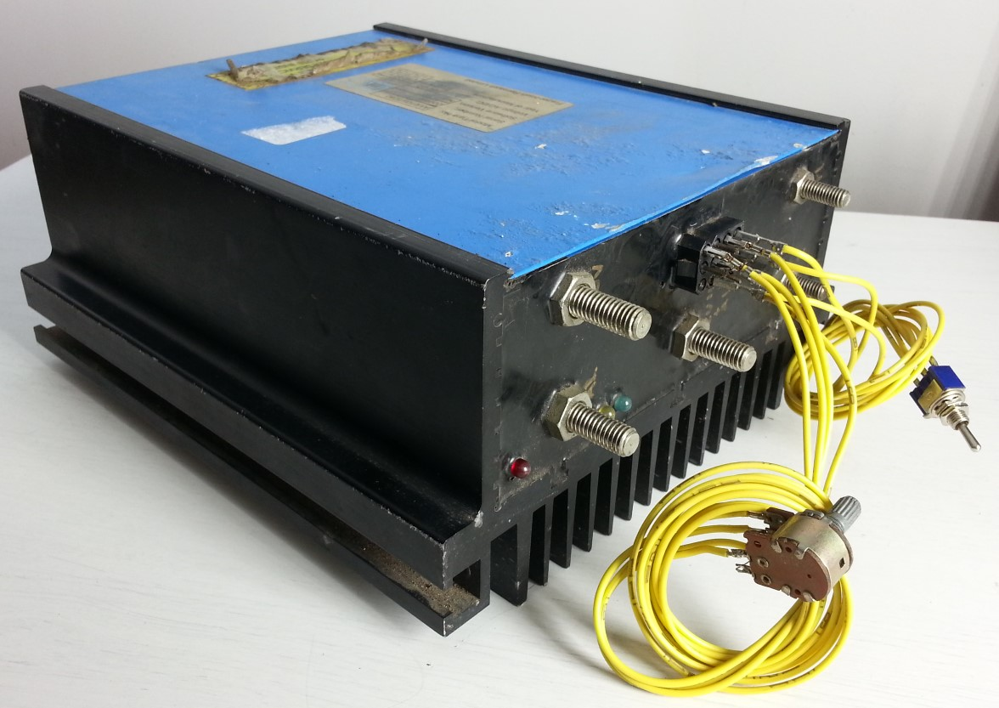

# FrazerNashTechInfo
Technical information for a brushed motor controller

This repository contains some information reverse engineered from a working sample in order to work out how to wire and use the controller.

This controller is believed to be used in a fleet of electric buggies during the 2000 sydney olympics and around that time. A newspaper article suggests the units were unreliable and the manufacturer more or less disappeared with no trace of support.

This information is shared with the aim of preserving the efforts made towards it, in the hope of this being useful to anyone who may happen to have come across one of these. No technical information was found online and the unit has no terminal markings making it otherwise difficult if not impossible to re-use.

Please use your own caution, judgement and precautions when using this information. Be sure to use a fuse at least for the battery supply, etc.

The internal circuit board has a several trimpots that might allow for adjusting various characteristics of the controller.  No further work was done towards this. 

# Specifications
- Make: Frazer-Nash
- Model/part number: A1/0105/3280

- Description: Motor controller for separately excited DC brushed motor
- Nominal input voltage: 72VDC
- Output power rating: Unknown. Estimated 5 - 10KW
- Used with motor
  - Motor Make: Frazer-Nash
  - Motor Model: A4/7053/3716.
  - Motor detail: High pole count, low speed, high torque. Output shaft connects directly to a differental gearbox input
  - Motor Weight: 39.2kg

# Exterior view

# Wiring Diagram

# Reverse engineering details

